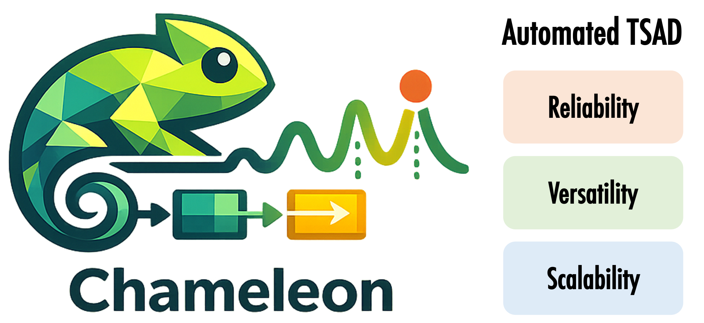
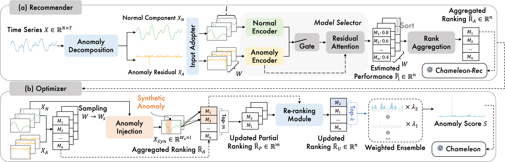

<p align="center">

</p>

<h2 align="center">🦎 Chameleon: Towards A Reliable and Efficient Automated System for Time-Series Anomaly Detection</h2>


## Table of Contents

- [📄 Overview](#overview)
- [✍️ Get Started](#start)
    * [💻 Installation](#install)
    * [🧑‍💻 Usage](#usage)  
- [⚙️ Reproducibility](#reproducibility)
    * [📖 Dataset](#dataset)
    * [🗄️ Candidate Models](#candidate)
    

<h2 id="overview"> 📄 Overview </h2>

<p align="center">

</p>

Time-series anomaly detection is widely applied across domains, where reliable and timely detection of outliers is critical for real-world decision making. Yet existing benchmarks on standalone detectors consistently highlight the absence of a one-size-fits-all model, motivating the development of automated solutions that reduce reliance on expert-driven selection and cumbersome tuning. However, this remains challenging due to the scarcity of labeled data as well as the heterogeneity of time series and anomaly types. Current approaches remain limited: some are confined to univariate settings, scalable methods often fail under distribution shift, and the most reliable solutions incur substantial computational overhead. We propose Chameleon, a reliable and efficient automated system for time-series anomaly detection, comprising a recommender that estimates candidate rankings and an optimizer that refines these rankings and ensembles for improved robustness. In the recommender stage, Chameleon introduces anomaly–residual decomposition and input adaptation with a neural selector to rank candidate detectors for time series of varying lengths and variates. Then in the optimizer stage, Chameleon performs anomaly-specific test-time adaptation via synthetic anomaly injection for pseudo-supervised re-ranking, followed by a weighted ensemble to improve robustness beyond single-model predictions. We conduct a comprehensive evaluation across time series from nine domains using rigorous statistical analysis. Chameleon outperforms 12 state-of-the-art automated solutions under both in-distribution and out-of-distribution settings. Notably, Chameleon is the first solution to match the performance of supervised model selection per dataset. In terms of scalability, Chameleon achieves up to 140x speedup over the previous most reliable strategy and maintains efficiency as time-series length increases, establishing it as both the most effective and efficient automated solution for time-series anomaly detection.

<h2 id="start"> ✍️ Get Started </h2>

<h3 id="install"> 💻 Installation </h3>

**Step 1:** Clone this repository using `git` and change into its root directory.

**Step 2:** Install the dependencies from requirements.txt:
```bash
pip install -r requirements.txt
```

<h3 id="usage"> 🧑‍💻 Usage </h3>

**Meta-training** If you would like to train your Chameleon-Rec using customized dataset:

```bash
cd chameleon/MolRec

python train_U.py --domain [domain id] --save_dir [weight saving direc] or
python train_M.py --domain [domain id] --save_dir [weight saving direc]
```

We provide our pretrained Chameleon-Rec weights at `testbed/ChameleonRec_weights`.


**Stage 1: Chameleon Recommender** provides the estimated candidate model ranking for the given dataset.

```bash
cd benchmark_exp
python run_AutoAD_U.py --AutoAD_Name ChameleonRec or
python run_AutoAD_U.py --AutoAD_Name ChameleonRec
```

**Stage 2: Chameleon Optimizer** refines the initial ranking and performs weighted ensembling to further improve robustness.

We use the following scripts for benchmarking practice:

```bash
cd benchmark_exp
python run_AutoAD_U_ranking.py --AutoAD_Name ChameleonOpt_precomputed --variant ID --save True --pretrained_weights [weight saving direc] --save_dir [eval result saving direc]
python run_AutoAD_U.py --AutoAD_Name ChameleonOpt_U_ID --variant [num of ens components] --save True --save_dir [eval result saving direc]
python run_AutoAD_U.py --AutoAD_Name ChameleonOpt_U_OOD --variant [num of ens components] --save True --save_dir [eval result saving direc]

python run_AutoAD_M_ranking.py --AutoAD_Name ChameleonOpt_precomputed --variant ID --save True --pretrained_weights [weight saving direc] --save_dir [eval result saving direc]
python run_AutoAD_M.py --AutoAD_Name ChameleonOpt_M_ID --variant [num of ens components] --save True --save_dir [eval result saving direc]
python run_AutoAD_M.py --AutoAD_Name ChameleonOpt_M_OOD --variant [num of ens components] --save True --save_dir [eval result saving direc]
```


<h2 id="reproducibility"> ⚙️ Reproducibility </h2>


The datasets and underlying base algorithms are based on TSB-AD benchmark [[Link]](https://thedatumorg.github.io/TSB-AD/).

* We release the ChameleonRec weights at `testbed/ChameleonRec_weights`
* Dataset Splitting: See `testbed/file_list`
* Hyper-parameter of Candidate Model Set: See `testbed/HP_list.py`


<h3 id="dataset"> 📖 Dataset </h3>

| Dataset    | Description|
|:--|:---------|
|UCR|A collection of univariate time series of multiple domains, including air temperature, arterial blood pressure, astronomy, ECG, and more. Most anomalies are introduced artificially.|
|NAB|Labeled real-world and artificial time series, including AWS server metrics, online advertisement click rates, real-time traffic data, and Twitter mentions of publicly traded companies.|
|YAHOO|A dataset published by Yahoo Labs, consisting of real and synthetic time series based on production traffic to Yahoo systems.|
|IOPS|A dataset with performance indicators reflecting the scale, quality of web services, and machine health status.|
|MGAB|Mackey-Glass time series, where anomalies exhibit chaotic behavior that is challenging for the human eye to distinguish.|
|WSD|is a web service dataset, which contains real-world KPIs collected from large Internet companies.|
|SED|a simulated engine disk data from the NASA Rotary Dynamics Laboratory representing disk revolutions recorded over several runs (3K rpm speed).|
|TODS|is a synthetic dataset that comprises global, contextual, shapelet, seasonal, and trend anomalies.|
|NEK|is collected from real production network equipment.|
|Stock|is a stock trading traces dataset, containing one million transaction records throughout the trading hours of a day.|
|Power|power consumption for a Dutch research facility for the entire year of 1997.|
|GHL|contains the status of 3 reservoirs such as the temperature and level. Anomalies indicate changes in max temperature or pump frequency.|
|Daphnet|contains the annotated readings of 3 acceleration sensors at the hip and leg of Parkinson's disease patients that experience freezing of gait (FoG) during walking tasks.|
|Exathlon|is based on real data traces collected from a Spark cluster over 2.5 months. For each of these anomalies, ground truth labels are provided for both the root cause interval and the corresponding effect interval.|
|Genesis|is a portable pick-and-place demonstrator that uses an air tank to supply all the gripping and storage units.|
|OPP|is devised to benchmark human activity recognition algorithms (e.g., classification, automatic data segmentation, sensor fusion, and feature extraction), which comprises the readings of motion sensors recorded while users executed typical daily activities.|
|SMD|is a 5-week-long dataset collected from a large Internet company, which contains 3 groups of entities from 28 different machines.|
|SWaT|is a secure water treatment dataset that is collected from 51 sensors and actuators, where the anomalies represent abnormal behaviors under attack scenarios.|
|PSM|is a dataset collected internally from multiple application server nodes at eBay.|
|SMAP|is real spacecraft telemetry data with anomalies from Soil Moisture Active Passive satellite. It contains time series with one feature representing a sensor measurement, while the rest represent binary encoded commands.|
|MSL|is collected from Curiosity Rover on Mars satellite.|
|CreditCard|is an intrusion detection evaluation dataset, which consists of labeled network flows, including full packet payloads in pcap format, the corresponding profiles, and the labeled flows.|
|GECCO|is a water quality dataset used in a competition for online anomaly detection of drinking water quality.|
|MITDB|contains 48 half-hour excerpts of two-channel ambulatory ECG recordings, obtained from 47 subjects studied by the BIH Arrhythmia Laboratory between 1975 and 1979.|
|SVDB|includes 78 half-hour ECG recordings chosen to supplement the examples of supraventricular arrhythmias in the MIT-BIH Arrhythmia Database.|
|LTDB|is a collection of 7 long-duration ECG recordings (14 to 22 hours each), with manually reviewed beat annotations.|
|CATSv2|is the second version of the Controlled Anomalies Time Series (CATS) Dataset, which consists of commands, external stimuli, and telemetry readings of a simulated complex dynamical system with 200 injected anomalies.|


<h3 id="candidate"> 🗄️ Candidate Models </h3>

> (i) Statistical Method

| Algorithm    | Description|
|:--|:---------|
|(Sub)-MCD|is based on minimum covariance determinant, which seeks to find a subset of all the sequences to estimate the mean and covariance matrix of the subset with minimal determinant. Subsequently, Mahalanobis distance is utilized to calculate the distance from sub-sequences to the mean, which is regarded as the anomaly score.|
|(Sub)-OCSVM|fits the dataset to find the normal data's boundary by maximizing the margin between the origin and the normal samples.|
|(Sub)-LOF|calculates the anomaly score by comparing local density with that of its neighbors.|
|(Sub)-KNN|produces the anomaly score of the input instance as the distance to its $k$-th nearest neighbor.|
|KMeansAD|calculates the anomaly scores for each sub-sequence by measuring the distance to the centroid of its assigned cluster, as determined by the k-means algorithm.|
|CBLOF|is clluster-based LOF, which calculates the anomaly score by first assigning samples to clusters, and then using the distance among clusters as anomaly scores.|
|POLY|detect pointwise anomolies using polynomial approximation. A GARCH method is run on the difference between the approximation and the true value of the dataset to estimate the volatility of each point.|
|(Sub)-IForest|constructs the binary tree, wherein the path length from the root to a node serves as an indicator of anomaly likelihood; shorter paths suggest higher anomaly probability.|
|(Sub)-HBOS|constructs a histogram for the data and uses the inverse of the height of the bin as the anomaly score of the data point.|
|KShapeAD| identifies the normal pattern based on the k-Shape clustering algorithm and computes anomaly scores based on the distance between each sub-sequence and the normal pattern. KShapeAD improves KMeansAD as it relies on a more robust time-series clustering method and corresponds to an offline version of the streaming SAND method.|
|MatrixProfile|identifies anomalies by pinpointing the subsequence exhibiting the most substantial nearest neighbor distance.|
|(Sub)-PCA|projects data to a lower-dimensional hyperplane, with significant deviation from this plane indicating potential outliers.|
|RobustPCA|is built upon PCA and identifies anomalies by recovering the principal matrix.|
|EIF|is an extension of the traditional Isolation Forest algorithm, which removes the branching bias using hyperplanes with random slopes.|
|SR| begins by computing the Fourier Transform of the data, followed by the spectral residual of the log amplitude. The Inverse Fourier Transform then maps the sequence back to the time domain, creating a saliency map. The anomaly score is calculated as the relative difference between saliency map values and their moving averages.|
|COPOD|is a copula-based parameter-free detection algorithm, which first constructs an empirical copula, and then uses it to predict tail probabilities of each given data point to determine its level of extremeness.|
|Series2Graph| converts the time series into a directed graph representing the evolution of subsequences in time. The anomalies are detected using the weight and the degree of the nodes and edges respectively.|
|SAND| identifies the normal pattern based on clustering updated through arriving batches (i.e., subsequences) and calculates each point's effective distance to the normal pattern.|


> (ii) Neural Network-based Method

| Algorithm    | Description|
|:--|:---------|
|AutoEncoder|projects data to the lower-dimensional latent space and then reconstruct it through the encoding-decoding phase, where anomalies are typically characterized by evident reconstruction deviations.|
|LSTMAD|utilizes Long Short-Term Memory (LSTM) networks to model the relationship between current and preceding time series data, detecting anomalies through discrepancies between predicted and actual values.|
|Donut|is a Variational AutoEncoder (VAE) based method and preprocesses the time series using the MCMC-based missing data imputation technique.|
|CNN|employ Convolutional Neural Network (CNN) to predict the next time stamp on the defined horizon and then compare the difference with the original value.|
|OmniAnomaly|is a stochastic recurrent neural network, which captures the normal patterns of time series by learning their robust representations with key techniques such as stochastic variable connection and planar normalizing flow, reconstructs input data by the representations, and use the reconstruction probabilities to determine anomalies.|
|USAD|is based on adversely trained autoencoders, and the anomaly score is the combination of discriminator and reconstruction loss.|
|AnomalyTransformer|utilizes the `Anomaly-Attention' mechanism to compute the association discrepancy.|
|TranAD|is a deep transformer network-based method, which leverages self-conditioning and adversarial training to amplify errors and gain training stability.|
|TimesNet|is a general time series analysis model with applications in forecasting, classification, and anomaly detection. It features TimesBlock, which can discover the multi-periodicity adaptively and extract the complex temporal variations from transformed 2D tensors by a parameter-efficient inception block.|
|FITS|is a lightweight model that operates on the principle that time series can be manipulated through interpolation in the complex frequency domain.|
|M2N2|uses exponential moving average for trend estimation to detrend data and updates model with normal test instances based on predictions for unsupervised TSAD distribution shifts.

> (iii) Foundation Model-based Method

| Algorithm    | Description|
|:--|:---------|
|OFA|finetunes pre-trained GPT-2 model on time series data while keeping self-attention and feedforward layers of the residual blocks in the pre-trained language frozen.|
|Lag-Llama|is the first foundation model for univariate probabilistic time series forecasting based on a decoder-only transformer architecture that uses lags as covariates.|
|Chronos|tokenizes time series values using scaling and quantization into a fixed vocabulary and trains the T5 model on these tokenized time series via the cross-entropy loss.|
|TimesFM|is based on pretraining a decoder-style attention model with input patching, using a large time-series corpus comprising both real-world and synthetic datasets.|
|MOMENT|is pre-trained T5 encoder based on a masked time-series modeling approach.|

> A detailed evaluation of base anomaly detectors, including overall performance and results across different anomaly types, is available at [[Homepage]](https://thedatumorg.github.io/TSB-AD/).
